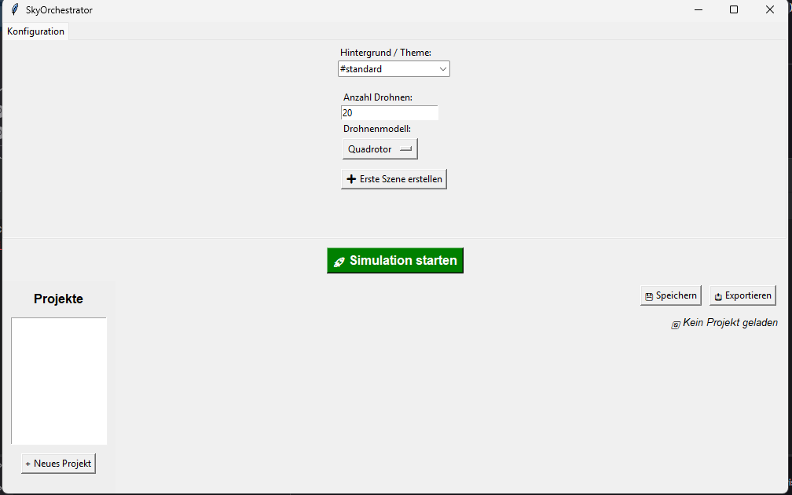
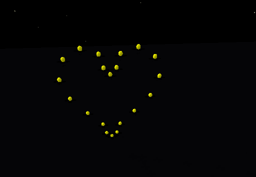

# SkyOrchestrator: Simulator für Drohnen-Lichtshows

SkyOrchestrator ist eine Desktop-Anwendung zur visuellen Gestaltung und Simulation von Drohnen-Lichtshows. Mit einer benutzerfreundlichen grafischen Oberfläche (GUI) können Benutzer komplexe Choreografien aus verschiedenen Formationen erstellen, diese als Szenen in einer Timeline anordnen und die gesamte Show in einer 3D-Umgebung, die von PyBullet angetrieben wird, in Echtzeit visualisieren.

## Funktionen

- **Intuitive GUI**: Eine mit Tkinter erstellte Oberfläche zur einfachen Verwaltung von Projekten und Szenen.
- **Szenenbasierte Choreografie**: Erstellen Sie eine Abfolge von Szenen, jede mit eigener Dauer, Lichtfarbe und Formation.
- **Vielfältige Formationstypen**:
    - **Text**: Drohnen formen automatisch von Ihnen eingegebene Wörter.
    - **Bilder**: Laden Sie eigene Bilder hoch, die von den Drohnen nachgezeichnet werden.
    - **Freihandzeichnen**: Zeichnen Sie eigene Formationen direkt in einem Zeichenfenster.
    - **Vordefinierte Formen**: Komplexe Formen wie Herzen, Kreise, Quadrate und Smileys.
    - **Animierte Formationen**: Dynamische Effekte wie ein Wasserfall, ein pulsierender Kreis oder eine aufsteigende Helix.
- **3D-Simulation**: Eine realistische Vorschau der Show mithilfe der PyBullet-Physik-Engine.
- **Projektmanagement**: Speichern und laden Sie Ihre Drohnenshows als einfach zu teilende JSON-Dateien.
- **Anpassbarkeit**: Wählen Sie aus verschiedenen Drohnenmodellen und Hintergrundthemen (z. B. ein dunkler Sternenhimmel).
- **Effiziente Pfadfindung**: Ein Optimierungsalgorithmus (basierend auf `scipy.optimize.linear_sum_assignment`) sorgt dafür, dass die Drohnen die kürzesten Wege zu ihren Zielpositionen fliegen, was die Bewegungen flüssiger macht.

## Visuals

*Ein Screenshot der Hauptoberfläche von SkyOrchestrator, der die Konfigurations- und Szenen-Tabs zeigt.*



*Ein GIF, das eine in der Simulation gebildete Herzformation zeigt.*



## Installation

Um SkyOrchestrator auf Ihrem System auszuführen, benötigen Sie Python 3 und die folgenden Bibliotheken.

1.  **Repository klonen oder herunterladen**
    Laden Sie die Projektdateien auf Ihren Computer herunter.

2.  **Abhängigkeiten installieren**
    Öffnen Sie ein Terminal im Projektverzeichnis und installieren Sie die erforderlichen Python-Pakete. Es wird empfohlen, dies in einer virtuellen Umgebung zu tun.

    ```bash
    pip install numpy pybullet scipy Pillow
    ```
    *Hinweis: `tkinter` ist in den meisten Python-Installationen standardmäßig enthalten.*

## Anwendung

1.  **Starten Sie die Anwendung**, indem Sie die Haupt-GUI-Datei ausführen:
    ```bash
    python main.py
    ```

2.  **Globale Konfiguration**:
    - Im Tab **"Konfiguration"** legen Sie die Gesamtzahl der verfügbaren Drohnen, das Drohnenmodell und das visuelle Thema für den Hintergrund fest.

3.  **Szenen erstellen**:
    - Wechseln Sie zum Tab **"Szenen"**.
    - Klicken Sie auf den **"+"**-Tab, um eine neue Szene zu Ihrer Show-Timeline hinzuzufügen.
    - Konfigurieren Sie jede Szene:
        - Wählen Sie einen **Formationstyp** (z. B. `#text`, `#image`, `ANIM:Wasserfall`).
        - Geben Sie die erforderlichen Daten ein (z. B. den Text, der angezeigt werden soll, oder laden Sie ein Bild hoch).
        - Legen Sie die **Dauer** der Szene in Sekunden und die **Lichtfarbe** der Drohnen fest.

4.  **Projekt speichern**:
    - Nutzen Sie die Buttons in der Seitenleiste oder oben rechts, um Ihr Projekt als `.json`-Datei zu speichern und später weiterzuarbeiten.

5.  **Simulation starten**:
    - Klicken Sie auf den grünen Button **"🚀 Simulation starten"**, um Ihre erstellte Drohnenshow in der 3D-Vorschau zu sehen.

## Mitwirken

Beiträge zur Verbesserung von SkyOrchestrator sind willkommen! Wenn Sie Ideen für neue Funktionen, Fehlerbehebungen oder Verbesserungen haben, fühlen Sie sich frei, einen Issue zu öffnen oder einen Pull Request zu stellen.

Das Projekt ist modular aufgebaut. Neue Formationen können beispielsweise einfach hinzugefügt werden, indem neue Funktionen in `shapes.py` (für statische Formen) oder `animated_formations.py` (für Animationen) erstellt und in die GUI (`scene_configurator.py`) eingebunden werden.

## Autoren und Danksagung

Dieses Projekt wurde als Teil eines Software-Entwicklungsprojekts erstellt. Wir danken allen, die zur Entwicklung beigetragen haben.

## Lizenz

Für Open-Source-Projekte ist es üblich, eine Lizenz anzugeben. Fügen Sie hier Ihre Lizenzinformationen ein, z. B.:
> Dieses Projekt ist unter der MIT-Lizenz lizenziert. Weitere Details finden Sie in der Datei `LICENSE`.

## Projektstatus

Das Projekt befindet sich in einem stabilen, funktionsfähigen Zustand und ist bereit zur Nutzung. Die Kernfunktionen sind implementiert. Zukünftige Entwicklungen könnten neue Formationen, eine verbesserte Performance-Optimierung oder zusätzliche GUI-Funktionen umfassen. Das Projekt wird derzeit aktiv gepflegt.tere Details finden Sie in der Datei LICENSE.